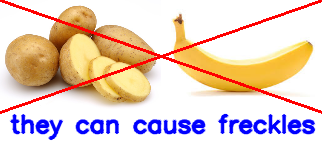

# Eat Safe Ear Well!
Input one image of a raw ingredient (fruit or vegetable), output examples of contradicting food against the input item.

## Structure
* [image/](image) directory holds examples of images used in testing. For dataset and CV model used, check out [this link](https://www.kaggle.com/databeru/fruit-and-vegetable-classification#2.-Load-the-Images-with-a-generator-and-Data-Augmentation)
* [model/](model) directory holds pretrained model used later for inference.
* [ConvolutionalNeuralNetwork.ipynb](ConvolutionalNeuralNetwork.ipynb) details the training process of the model done by [databeru](https://www.kaggle.com/databeru/fruit-and-vegetable-classification#2.-Load-the-Images-with-a-generator-and-Data-Augmentation).
* [IngredientToContradiction.ipynb](IngredientToContractions.ipynb) details the contradiction matching process, given a single food item.
* [ModelRunner.ipynb](ModelRunner.ipynb) initializes model loading.
* [ShowImage.ipynb](ShowImage.ipynb) details the output generation process. 
* [TreehacksProject.ipynb](TreehacksProject.ipynb) is the **complete** pipeline for the program.
* \*.txt are hand typed lists of contradictions collected from the Internet. All are used only for the purpose of testing the functionality of this program, and are not meant to be treated as scientific tested claims.

## Recreation
1. Open TreehacksProject.ipynb in GoogleColab (or jupyter notebook)
2. Run all lines of code with all other file/directories in the correct corresponding directories.

## What's Next?
Use more data of images for more types of raw food ingredients; collect more systematic dataset on the contradictions (as currently all contradictions are from unrelyable online sources). Better result presentation than an image. More complete UX/pacakge program into a mini mobile app.

## Datasets/Model Used
[Dataset](https://www.kaggle.com/kritikseth/fruit-and-vegetable-image-recognition)
[Model](https://www.kaggle.com/databeru/fruit-and-vegetable-classification)

## Liscence
This project was made for sole purpose of TreeHack2022. Do not use any code included for any other purpose.
